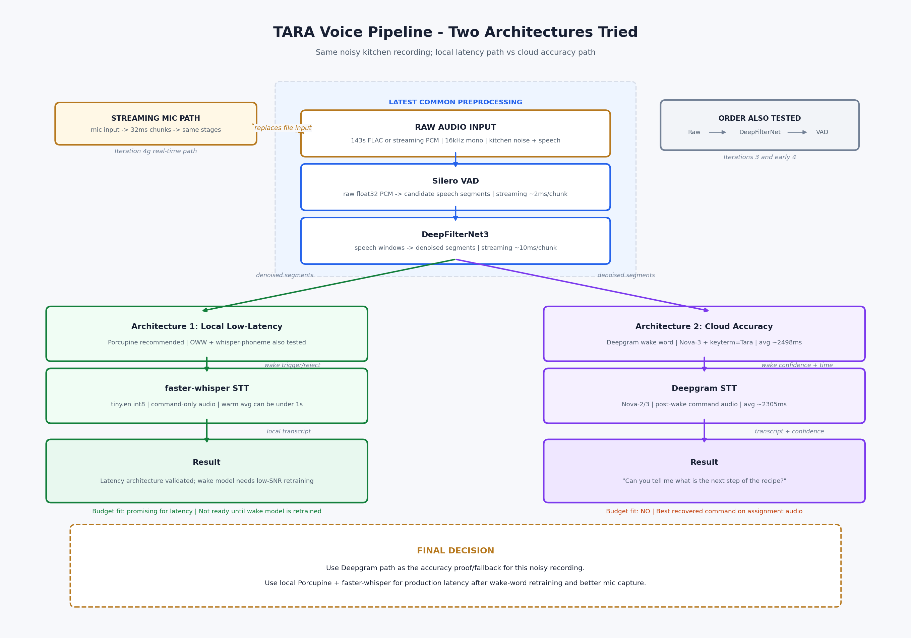

# Tara Voice Pipeline

End-to-end voice command pipeline for a kitchen assistant. Detects the wake word **"Hey Tara" / "Tara"**, suppresses kitchen noise, and transcribes the spoken command — all with per-stage latency tracking.

Built as a Speech AI Engineer assignment. Iterated through 4 pipeline designs, documented every failure and fix.

---

## Table of Contents

- [Demo](#demo)
- [Pipeline Architecture](#pipeline-architecture)
- [Tech Stack](#tech-stack)
- [Prerequisites](#prerequisites)
- [Getting Started](#getting-started)
- [Environment Variables](#environment-variables)
- [Usage](#usage)
- [Project Structure](#project-structure)
- [Iteration History](#iteration-history)
- [Latency Budgets](#latency-budgets)
- [Troubleshooting](#troubleshooting)

---

## Demo

**Input:** Noisy kitchen recording (143s, pressure cooker + chopping + background noise)

**Best recovered output from latest Deepgram wake word + Deepgram STT run:**
```
Wake word TRIGGERED at 34.13s | backend=deepgram
TRANSCRIPT: "Can you tell me what is the next step of the recipe?"
```

**Denoised audio sample:** `assets/denoised_output.wav`

**Pipeline diagram:**



---

## Two Architectures Tried

During development, I tested two main architectures on the same noisy kitchen recording and compared accuracy against latency.

### Architecture 1: Local Low-Latency Pipeline

**Flow:**

```text
Audio -> VAD -> DeepFilterNet -> Local wake word detector -> faster-whisper STT
```

**Backends tested:**
- openWakeWord custom classifier
- Porcupine custom `.ppn`
- Whisper phoneme wake-word check
- faster-whisper tiny.en for STT

**Result:**
- Best latency profile.
- Porcupine wake word was ~1.6-13ms, well under the 300ms wake-word budget.
- faster-whisper STT was usually within the 1s average budget after warm-up.
- Local wake-word models failed on this specific noisy Indian-accented recording.
- Porcupine produced 0 true positives and 1 false positive in the final retest.
- openWakeWord had high false positives or missed the true wake word depending on threshold/model version.
- Conclusion: good production architecture for latency, but it needs better microphone placement or retraining with Indian-accent "Tara" samples plus kitchen-noise augmentation.

### Architecture 2: Cloud Accuracy Pipeline

**Flow:**

```text
Audio -> VAD -> per-segment DeepFilterNet -> DeepgramWakeWord -> Deepgram STT
```

**Backends used:**
- Deepgram Nova-3 + keyterm `Tara` for wake-word detection
- Deepgram Nova-2 / Nova-3 for STT

**Result:**
- Best accuracy on the provided recording.
- Latest file run detected 3 wake-word triggers and rejected 3 non-trigger segments.
- Best recovered command transcript: "Can you tell me what is the next step of the recipe?"
- Latency was over budget:
  - Wake word average: ~2,498ms
  - STT average: ~2,305ms
  - Total average: ~6,406ms
- Conclusion: best accuracy diagnostic/fallback path, but not latency-compliant because two cloud API calls are stacked.

### Final Decision

The final implemented pipeline keeps both paths available:

- **For accuracy on the assignment recording:** Deepgram wake word + Deepgram STT gives the clearest transcript.
- **For production latency:** local wake word such as Porcupine is the right architecture, but it must be retrained on better target data and used with improved microphone placement.

This is why the submission documents both: one architecture proves the command can be recovered, and the other shows the latency-compliant production direction.

### Preprocessing Order Tested

```text
Early order:  Audio -> DeepFilterNet -> VAD -> Wake Word/STT
Latest order: Audio -> VAD -> per-segment DeepFilterNet -> Wake Word/STT
```

The denoise-first order is part of the experiment log. The latest diagram and code use VAD first, then DeepFilterNet on candidate speech segments, because this is more efficient for streaming and avoids denoising long non-speech regions.

---

## Pipeline Architecture

```text
Raw Audio (16kHz mono)
       |
       v
+-------------------------+
| Silero VAD              |  Voice activity detection on raw audio
| batch file / streaming  |  Finds candidate speech segments
+-----------+-------------+
            |
            v
+-------------------------+
| DeepFilterNet3          |  Neural noise suppression
| per speech segment      |  Cleans only the candidate segment
+-----------+-------------+
            |
            v
+-------------------------+
| DeepgramWakeWord        |  "Hey Tara" / "Tara" detection
| Nova-3 + keyterm=Tara   |  3.0s probe window
+-----------+-------------+
            |
            v
+-------------------------+
| STT                     |  Deepgram for best accuracy,
| Deepgram or faster-whisper | faster-whisper for lower latency
+-------------------------+
```

---

## Tech Stack

| Component | Technology | Why |
|-----------|-----------|-----|
| **Noise Suppression** | DeepFilterNet3 (ONNX) | Handles non-stationary kitchen noise (pressure cooker, chopping) |
| **VAD** | Silero VAD (ONNX) | Lightweight, CPU-only, 1MB model |
| **Wake Word** | Deepgram nova-3 + keyterm | Best accuracy on Indian-accented "Tara" |
| **STT** | Deepgram Nova-2/3 or faster-whisper tiny.en (int8) | Deepgram gives best accuracy; faster-whisper is the lower-latency local/server candidate |
| **Language** | Python 3.12 | |
| **Streaming** | sounddevice + VADIterator | Real-time mic input |
| **Dashboard** | FastAPI + HTML/Tailwind | Upload audio, get denoised audio + transcript |

---

## Prerequisites

- **Python 3.10+** (tested on 3.12)
- **pip** (comes with Python)
- **Deepgram API key** — free at [console.deepgram.com](https://console.deepgram.com) (no credit card)
- **Porcupine API key** (optional) — for local wake word detection at [picovoice.ai](https://picovoice.ai)
- **Microphone** — only needed for streaming mode

> **Windows note:** All commands below use forward slashes. Tested on Windows 11.

---

## Getting Started

### 1. Clone the Repository

```bash
git clone <repo-url>
cd Tara
```

### 2. Create Virtual Environment

```bash
python -m venv env
```

Activate it:

- **Windows:** `env\Scripts\activate`
- **Mac/Linux:** `source env/bin/activate`

### 3. Install Dependencies

```bash
pip install -r requirements.txt
```

> First install takes 5–10 minutes — downloads PyTorch, DeepFilterNet, faster-whisper models.

Install the pipeline package itself:

```bash
pip install -e .
```

For the optional dashboard and streaming microphone mode, install the optional runtime packages if they are not already present:

```bash
pip install fastapi uvicorn python-multipart sounddevice requests
```

### 4. Set Up Environment Variables

Create a `.env` file in the project root:

```bash
# .env
DEEPGRAM_API_KEY=your_deepgram_api_key_here
PORCUPINE_ACCESS_KEY=your_porcupine_key_here   # optional
```

> Never commit `.env` — it's in `.gitignore`.

### 5. Verify Installation

```bash
python -c "from tara_pipeline.pipeline import TaraPipeline; print('OK')"
```

---

## Environment Variables

| Variable | Required | Description | Where to Get |
|----------|----------|-------------|--------------|
| `DEEPGRAM_API_KEY` | **Yes** (for deepgram backend) | Deepgram API key for wake word + STT | [console.deepgram.com](https://console.deepgram.com) |
| `PORCUPINE_ACCESS_KEY` | No | Picovoice key for local wake word | [picovoice.ai](https://picovoice.ai) |

---

## Usage

### Run Batch Pipeline (on a file)

```bash
python scripts/run_pipeline.py assets/tara_assignment_recording_clipped.flac \
  --iteration 4 \
  --wake-word-backend deepgram \
  --stt-backend deepgram \
  --log-level INFO
```

**Options:**

| Flag | Values | Default | Description |
|------|--------|---------|-------------|
| `--iteration` | `1` `2` `3` `4` | `4` | Pipeline version (see Iteration History) |
| `--wake-word-backend` | `deepgram` `porcupine` `openwakeword` `whisper_phoneme` | `whisper_phoneme` | Wake word detector |
| `--stt-backend` | `faster_whisper` `whisper` `deepgram` | `faster_whisper` | STT engine. With `--wake-word-backend deepgram`, the CLI auto-selects Deepgram STT for accent accuracy. |
| `--log-level` | `DEBUG` `INFO` `WARNING` | `INFO` | Log verbosity |

**Expected output (Iteration 4, deepgram):**
```
VAD segments detected: 6
Wake word triggers: 3
Wake word rejected: 3
Commands transcribed: 3

[3] 34.13s-39.95s | 3599ms (OVER BUDGET)
     TRANSCRIPT: 'Can you tell me what is the next step of the recipe?'
```

---

### Run Streaming Pipeline (live mic)

```bash
python scripts/stream_pipeline.py --wake-word-backend deepgram
```

Say **"Hey Tara"** or **"Tara"** into your mic. The pipeline will:
1. Detect speech via VAD
2. Check for wake word
3. Transcribe your command
4. Print it to terminal

**With Deepgram STT (better accuracy, more latency):**
```bash
python scripts/stream_pipeline.py \
  --wake-word-backend deepgram \
  --stt-backend deepgram \
  --deepgram-stt-model nova-3
```

**Streaming options:**

| Flag | Values | Default | Description |
|------|--------|---------|-------------|
| `--wake-word-backend` | `deepgram` `porcupine` `openwakeword` `whisper_phoneme` | `deepgram` | Wake word detector |
| `--stt-backend` | `faster_whisper` `deepgram` | `faster_whisper` | STT engine |
| `--deepgram-stt-model` | `nova-3` `nova-2` | `nova-3` | Deepgram model (deepgram stt only) |

---

### Run Dashboard (Web UI)

```bash
python app.py
```

Open [http://localhost:8000](http://localhost:8000) in your browser.

- Drag and drop any audio file (WAV, FLAC, MP3, OGG, M4A)
- Get denoised audio back (playable in browser)
- See transcript, wake word triggers, and stage latency table

---

### Benchmark Latency

```bash
python scripts/benchmark_latency.py assets/tara_assignment_recording_clipped.flac
```

Outputs per-stage Avg/P95 latency vs budget table.

---

### Run All Iterations

```bash
python scripts/run_iterations.py assets/tara_assignment_recording_clipped.flac
```

Runs iterations 1–4 sequentially and prints a comparison table.

---

### Generate Pipeline Diagram

```bash
python scripts/generate_diagram.py
```

Saves `docs/pipeline_flow.png`.

---

## Project Structure

```
Tara/
├── assets/
│   ├── tara_assignment_recording_clipped.flac  # Test audio (143s, noisy kitchen)
│   └── denoised_output.wav                     # DeepFilterNet output sample
│
├── docs/
│   ├── methodology.md                          # Full iteration analysis + failure docs
│   └── pipeline_flow.png                       # Architecture diagram
│
├── tara_pipeline/                              # Core pipeline package
│   ├── config.py                               # All tunable parameters + latency budgets
│   ├── pipeline.py                             # Main orchestrator (TaraPipeline class)
│   └── stages/
│       ├── noise_suppression.py                # DeepFilterNet + noisereduce
│       ├── vad.py                              # Silero VAD
│       ├── wake_word.py                        # Deepgram / Porcupine / OWW / Whisper phoneme
│       └── stt.py                              # faster-whisper / Whisper / Deepgram STT
│
├── scripts/
│   ├── run_pipeline.py                         # CLI: run pipeline on a file
│   ├── stream_pipeline.py                      # Real-time mic streaming
│   ├── benchmark_latency.py                    # Latency profiling
│   ├── run_iterations.py                       # Run all 4 iterations
│   └── generate_diagram.py                     # Generate pipeline_flow.png
│
├── app.py                                      # FastAPI dashboard backend
├── frontend/index.html                         # Dashboard UI (Tailwind, dark theme)
│
├── Hey-tara_en_windows_v4_0_0/                 # Porcupine wake word model — Windows x64
├── Hey-Tara_en_raspberry-pi_v4_0_0/            # Porcupine wake word model — Raspberry Pi ARM64
│
├── requirements.txt                            # Python dependencies
├── pyproject.toml                              # Package config
└── .env                                        # API keys (NOT in git)
```

---

## Iteration History

| Iteration | Noise Suppression | VAD | Wake Word | STT | Result |
|-----------|------------------|-----|-----------|-----|--------|
| **1** | None | None | None | Whisper base | Baseline — fails on noise |
| **2** | noisereduce | None | None | Whisper base | Fails on impulsive noise (pressure cooker) |
| **3** | DeepFilterNet3 | Silero | None | faster-whisper tiny.en | Good STT, no wake word gate |
| **4** | DeepFilterNet3 | Silero | Deepgram nova-3 | faster-whisper or Deepgram | Implemented full pipeline; latest Deepgram STT run recovered the best command text but exceeded latency budget |

**Wake word experiments within Iteration 4:**

| Backend | Triggers | False Positives | Latency | Notes |
|---------|----------|-----------------|---------|-------|
| openWakeWord | 0/3 | 0 | ~50ms | Model not trained on "Tara" |
| Porcupine (custom .ppn) | 1/3 wrong | 1 | 2ms | Custom model fails on Indian accent |
| Whisper phoneme | 2/3 | 0 | ~300ms | Short probe clips "Tara" onset |
| **Deepgram nova-3 + keyterm** | 3 triggers | 0 confirmed false positives; 2 wake-only/uncertain | ~2200ms | Best wake-word accuracy, over latency budget |

Full analysis: [`docs/methodology.md`](docs/methodology.md)

---

## Latency Budgets

| Stage | Streaming estimate | Budget | Status |
|-------|--------------------|--------|--------|
| Noise Suppression | ~10ms/chunk | 200ms | OK (batch: 6800ms — artifact) |
| VAD | ~2ms/chunk | 100ms | OK (batch: 1500ms — artifact) |
| Wake Word (Deepgram) | ~2200ms API | 300ms | **OVER** — India→US RTT |
| Wake Word (Porcupine) | ~2ms local | 300ms | OK — but poor accuracy |
| STT (faster-whisper) | ~300-800ms warm, higher on long segments | 1000ms | OK avg / p95 can exceed |
| STT (Deepgram) | ~2300ms in latest file run | 1000ms | **OVER** |
| **Total (Porcupine + faster-whisper)** | **~305ms estimate** | 2000ms | **OK estimate, but Porcupine missed this noisy/accented clip** |
| **Total (Deepgram WW + Deepgram STT)** | **~6400ms avg latest file run** | 2000ms | **OVER** |

> **Note:** Batch latency numbers (NS=6800ms, VAD=1500ms) are processing a full 143s file at once — not representative of streaming. In streaming mode each 32ms chunk processes in ~12ms total (NS + VAD).
>
> **Production recommendation:** Use Porcupine for wake word (2ms, local) only after retraining with Indian-accent "Tara" samples plus chimney-noise augmentation. Deepgram is the best documented accuracy path for this clip, but it is over the latency budget.
>
> **Raspberry Pi deployment:** Both Windows and Pi `.ppn` models are included. On Pi, update `config.py`:
> ```python
> PORCUPINE_KEYWORD_PATHS = ["Hey-Tara_en_raspberry-pi_v4_0_0/Hey-Tara_en_raspberry-pi_v4_0_0.ppn"]
> ```
> Then install ARM64 PyTorch: `pip install torch --index-url https://download.pytorch.org/whl/cpu`

---

## Troubleshooting

### `ModuleNotFoundError: No module named 'tara_pipeline'`

```bash
pip install -e .
```

### `DEEPGRAM_API_KEY not set`

Create `.env` in the project root:
```bash
DEEPGRAM_API_KEY=your_key_here
```

### DeepFilterNet fails to load

```bash
pip install deepfilternet==0.5.6
```

If torchaudio version conflict — the pipeline applies a compatibility shim automatically (`_patch_torchaudio_compat` in `noise_suppression.py`).

### Silero VAD fails to download

It downloads from torch hub on first run. Requires internet. Cached at:
- Windows: `C:\Users\<user>\.cache\torch\hub\snakers4_silero-vad_master`

Force re-download:
```bash
python -c "import torch; torch.hub.load('snakers4/silero-vad', 'silero_vad', force_reload=True)"
```

### Porcupine: `Invalid access key`

Set env var:
```bash
# Windows PowerShell
$env:PORCUPINE_ACCESS_KEY="your_key"

# or in .env file
PORCUPINE_ACCESS_KEY=your_key
```

### Streaming mic not detected

List available devices:
```bash
python -c "import sounddevice; print(sounddevice.query_devices())"
```

Set device index if needed (edit `stream_pipeline.py` → `sd.InputStream(device=N, ...)`).

### Dashboard won't start

```bash
pip install fastapi uvicorn python-multipart
python app.py
```

---

## Key Configuration

All tunable parameters are in `tara_pipeline/config.py`:

```python
# Audio
SAMPLE_RATE = 16_000           # Hz
VAD_SPEECH_PAD_MS = 2000       # 2s back-pad to capture "Tara" before VAD fires

# Wake word
DEEPGRAM_WAKE_PROBE_S = 3.0    # Probe duration for detection context
DEEPGRAM_WAKE_CLIP_S = 1.5     # How much to clip before STT (skip wake phrase)
OWW_THRESHOLD = 0.70
PORCUPINE_SENSITIVITY = 0.9

# STT
FASTER_WHISPER_MODEL = "tiny.en"
FASTER_WHISPER_COMPUTE_TYPE = "int8"
FASTER_WHISPER_BEAM_SIZE = 1   # Greedy — lowest latency

# Latency budgets (ms)
BUDGET_NOISE_SUPPRESSION_MS = 200
BUDGET_VAD_MS = 100
BUDGET_WAKE_WORD_MS = 300
BUDGET_STT_MS = 1000
BUDGET_TOTAL_MS = 2000
```
